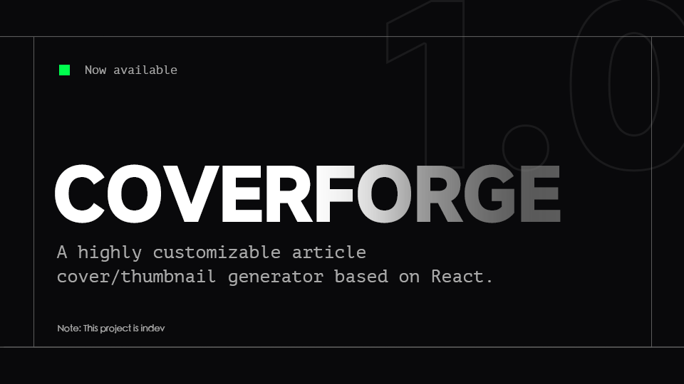

# CoverForge // Article Image Generator

  

**CoverForge** 是一个基于 React 的高度可定制化文章封面/缩略图生成器。它采用复古工业（Industrial/Cyberpunk）设计风格，允许用户实时预览并导出 PNG 图片。



---

## 核心特性

*   **WYSIWYG 实时预览**：无论屏幕尺寸如何（手机或宽屏），预览区的排版、换行与最终导出图片完全一致。
*   **滤镜烘焙导出**：支持背景图片的**模糊 (Blur)** 和 **亮度 (Brightness)** 调节。
*   **自定义排版**：
    *   支持自定义 `.ttf` / `.otf` 字体上传。
    *   九宫格文字对齐系统。
    *   动态字号调节。
*   **灵活背景**：支持纯色背景或本地图片上传。
*   **工业风 UI**：独特的参数化设计界面，带动画交互。

---

## 技术栈

*   **Core**: [React](https://react.dev/) (Hooks: `useState`, `useRef`, `useEffect`)
*   **Styling**: [Tailwind CSS](https://tailwindcss.com/)
*   **Rendering**: [html2canvas-pro](https://www.npmjs.com/package/html2canvas-pro) (优化的截图库)

---

## 快速开始

### 1. 安装依赖

```bash
pnpm install
```

### 2. 启动本地开发服务器

```bash
pnpm dev
```

## 使用指南

### 界面概览

界面分为左右（或上下）两部分：
*   **VIEWPORT (左/上)**：实时渲染区域，所见即所得。
*   **CONFIGURATION (右/下)**：控制面板。

### 操作步骤

1.  **TEXT_INPUT**: 输入主标题和副标题。
2.  **TYPOGRAPHY**:
    *   选择预设字体，或点击虚线框上传本地字体文件。
    *   使用九宫格调整文字在画面中的位置。
    *   拖动滑块调整字号。
3.  **BACKGROUND**:
    *   **SOLID COLOR**: 选择纯色背景。
    *   **IMAGE FILE**: 上传本地图片。上传后可调节 **BLUR** (模糊) 和 **BRIGHTNESS** (亮度)。
4.  **THEME**: 自定义装饰条颜色和文字颜色。
5.  **DOWNLOAD**: 点击按钮生成并下载 PNG 文件。

---

## 组件配置结构

虽然组件是封装好的，但你可以修改顶部的常量来调整默认行为：

```javascript
// 渲染基准尺寸 (建议维持 16:9 比例)
const BASE_WIDTH = 1280;
const BASE_HEIGHT = 720;

// 预设字体列表
const PRESET_FONTS = [
  { name: 'System Sans', value: 'sans-serif' },
  // ... 添加更多预设
];
```

---

## License

The MIT License.
